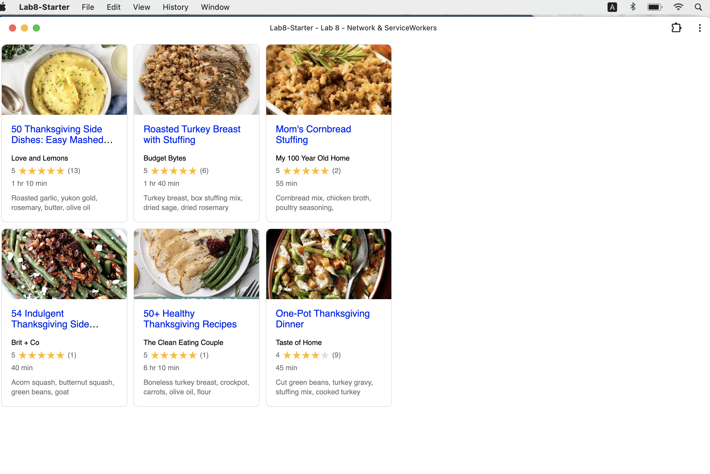

# Lab8-Starter
**Charlotte Dong A16899597**

Graceful degradation and service workers both help to boost the user experience by ensuring the app keeps running smoothly. If an app is losing its advanced features, graceful degradation steps in, ensuring it still works at least in a simpler form. If there are bad or no internet connections, service workers cache resources and handling network requests so the app remains functional offline. Both graceful degredation and service workers emphasize usability and accessibility, ensuring that users can continue to engage with the app regardless of network issues or browser limitations. 

